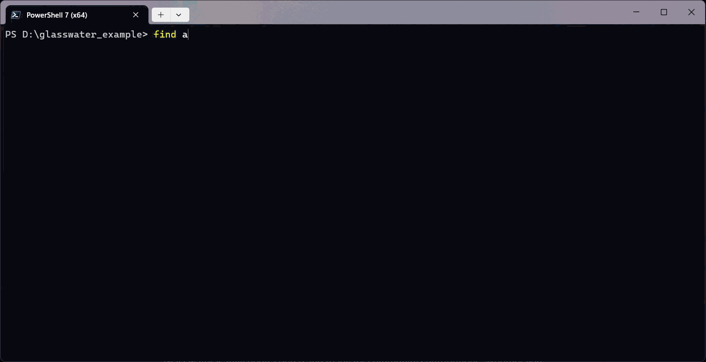

# glasswater

Inline ghost-text completions for PowerShell, powered by local [Ollama](https://ollama.com) and Qwen2.5-Coder FIM.

Type a partial command, pause for about a quarter second, and a gray suggestion appears inline. Accept it with the Right Arrow (same as native PSReadLine suggestions). History matches use PSReadLine's built-in history; everything else uses your local Ollama model.



Detailed user docs: [Tool Guide](docs/TOOL_GUIDE.md).

## Requirements

- PowerShell 7.4+
- PSReadLine 2.2.2+ (installed automatically with `Install-Module`)
- [Ollama](https://ollama.com) running locally
- Model: `qwen2.5-coder:1.5b-base`

## Install

```powershell
Install-Module glasswater -AllowPrerelease -Scope CurrentUser
Import-Module glasswater
Initialize-Glasswater
```

Pull the model once (script ships inside the module):

```powershell
$root = Split-Path (Get-Module glasswater).Path
& "$root\scripts\Install-OllamaModel.ps1"
```

Optional: keep the model loaded for faster suggestions:

```powershell
$env:OLLAMA_KEEP_ALIVE = '-1'
```

## Usage

After `Initialize-Glasswater`, open any PowerShell session and start typing:

- **Command prefix** -- e.g. type `Get-Child` and pause; ghost text completes the cmdlet.
- **History** -- if you ran a command before, typing its prefix shows the history match (no Ollama wait).
- **Mid-line edit** -- cursor in the middle of a pipeline; Ollama fills in the gap (FIM).
- **Natural language** -- e.g. `list all files in the dir`; Right Arrow replaces the line with a generated command.

Run `Initialize-Glasswater` from your `$PROFILE` if you want it in every session.

## Development

Clone the repo, install the Ollama model, and launch a dev session:

```powershell
./Install-OllamaModel.ps1
./Start-GlasswaterDev.ps1
```

That builds the module and opens a new PowerShell window with glasswater loaded.

To build and load manually:

```powershell
./Build-Glasswater.ps1
Import-Module ./artifacts/glasswater-dev/glasswater.dll -Force
Initialize-Glasswater
```

See [SPEC.md](SPEC.md) for architecture, parameters, and verification steps.
